# Практическая работа №6. Отладка приложений. Использование Logcat и таймеров
#### Изучить инструменты отладки Android-приложений. Научиться использовать Logcat для логирования сообщений различных уровней, а также применять таймеры (Timer, Chronometer) для выполнения отсроченных и периодических задач

Выполнил ИНС-б-о-24-1, Пузанов Александр Александрович

### Ход выполнения практической работы:
#### 1. Знакомство с Logcat:
Мои сообщения (package:mine в фильтре):

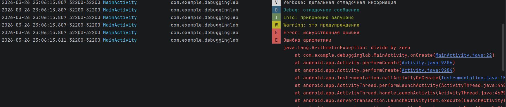

Только Verbose:

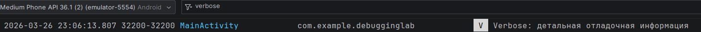

Только debug + мой package в фильтре:

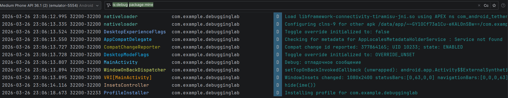

MainActivity:

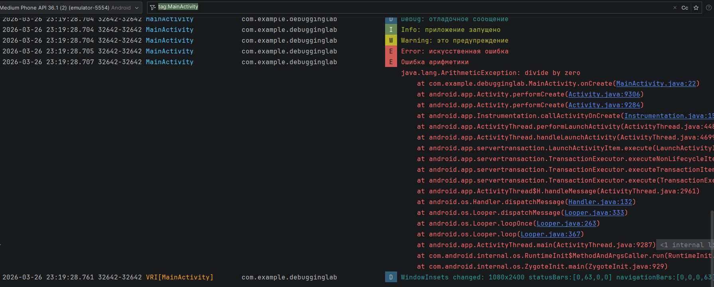

Поиск по тексту:

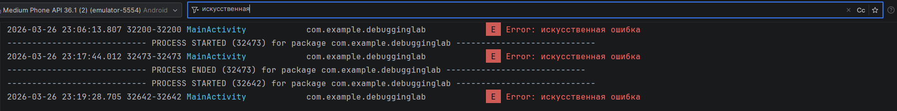
#### 2. Использование точек останова:
Открытый Debugger:

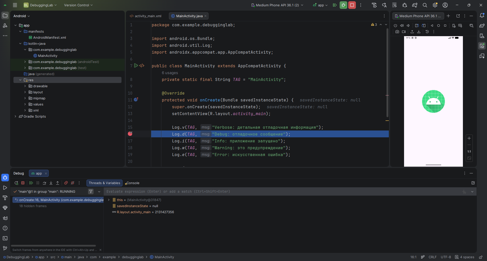

Step Over и переменные this:

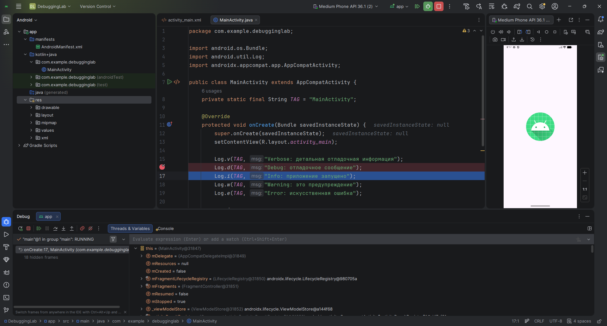

Resume Program:

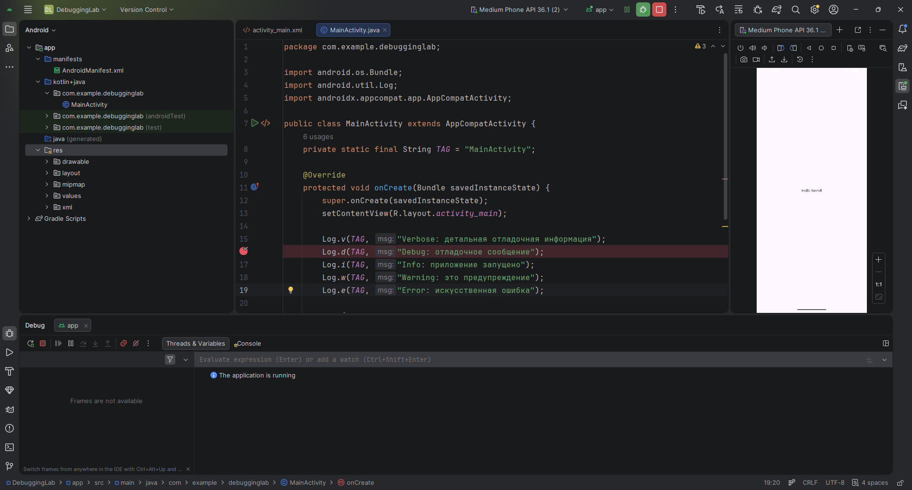
#### 3. Работа с Timer:
После нажатия кнопки:

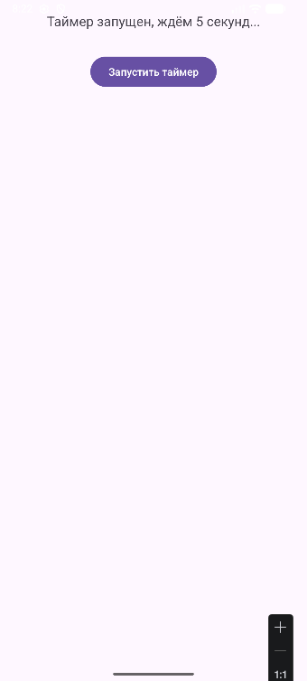

5 секунд спустя:

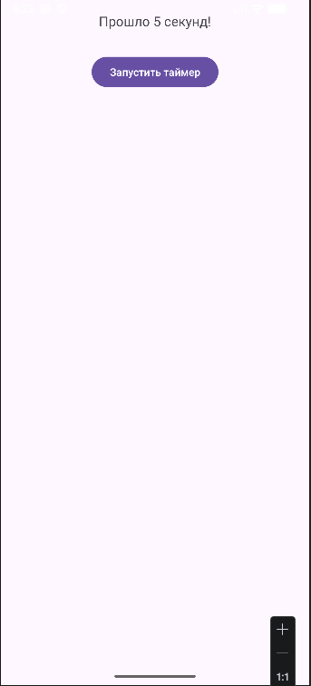
#### 4. Модель данных:
Вторая кнопка для перехода на секундомер:
```java
Button btn2 = findViewById(R.id.btn2);

btn2.setOnClickListener(new View.OnClickListener() {
    @Override
    public void onClick(View v) {
        Intent intent = new Intent(MainActivity.this, StopwatchActivity.class);
        startActivity(intent);
    }
});
```
Таймер:

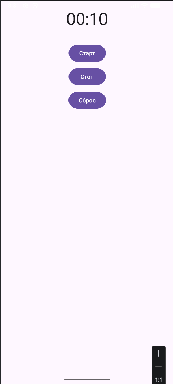
### Ход выполнения задания для самостоятельного выполнения (вариант 2):
#### 5. Последовательность Фибоначчи:
Код:
```java
import android.os.Bundle;
import android.os.CountDownTimer;
import android.util.Log;
import android.widget.Button;
import android.widget.TextView;
import androidx.appcompat.app.AppCompatActivity;

public class MainActivity extends AppCompatActivity {

    private static final String TAG = "Lab6";

    private TextView tvResult;
    private Button btnStart;

    private long prev = 0;
    private long current = 1;

    @Override
    protected void onCreate(Bundle savedInstanceState) {
        super.onCreate(savedInstanceState);
        setContentView(R.layout.activity_main);

        tvResult = findViewById(R.id.tvResult);
        btnStart = findViewById(R.id.btnStart);

        btnStart.setOnClickListener(v -> startFibonacci());
    }

    private void startFibonacci() {

        tvResult.setText("Старт...");
        prev = 0;
        current = 1;

        new CountDownTimer(60000, 1000) { // 60 секунд, шаг 1 сек

            @Override
            public void onTick(long millisUntilFinished) {

                long next = prev + current;
                prev = current;
                current = next;

                String text = "Fibonacci: " + current;

                tvResult.setText(text);
                Log.i(TAG, text);
            }

            @Override
            public void onFinish() {
                Log.i(TAG, "Таймер завершён");
            }

        }.start();
    }
}
```
Начальный экран:

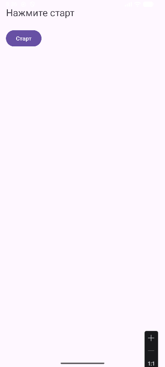

Промежуточный результат:

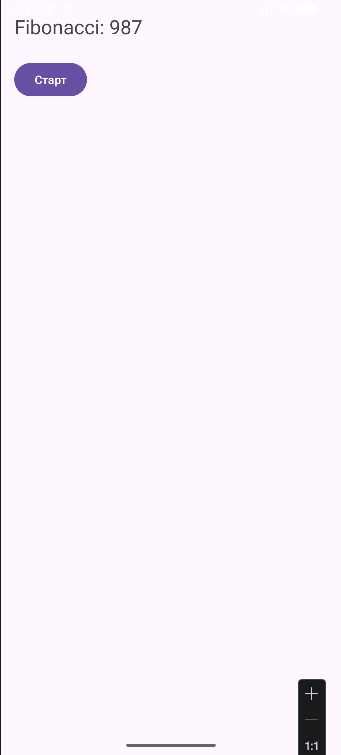

Конечный результат:

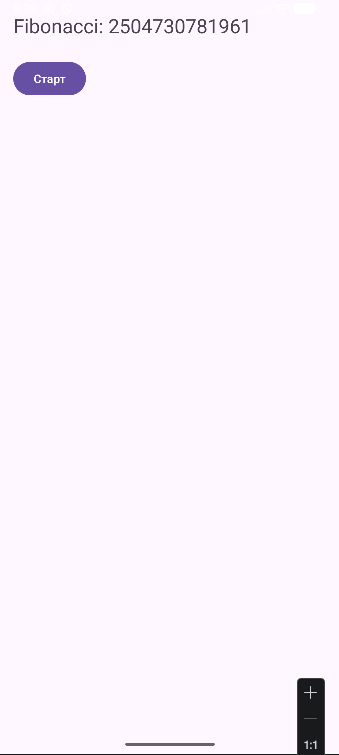
### Контрольные вопросы:
1. Какие уровни логирования существуют в Android? Для каких целей используется каждый из них?
Verbose (Log.v) - максимально подробная отладка
Debug (Log.d) - отладочная информация
Info (Log.i) - нормальная работа приложения
Warning (Log.w) - предупреждения
Error (Log.e) - ошибки
2. Как открыть окно Logcat в Android Studio? Как отфильтровать сообщения только по тегу и только по уровню Error?
Открытие: View -> Tool Windows -> Logcat
Фильтрация:
- по тегу - ввести тег в поиск (например, MainActivity)
- по уровню Error - выбрать уровень Error в выпадающем списке
3. В чем разница между методами Log.e() и Log.w()? Приведите примеры использования.
Log.w - предупреждение (не критично)
Log.e - ошибка (что-то сломалось)
Примеры:
Log.w(TAG, "Warning: это предупреждение");
Log.e(TAG, "Error: искусственная ошибка");
4. Что такое точка останова (breakpoint)? Как запустить приложение в режиме отладки?
Точка останова - место, где выполнение кода останавливается
Запуск: кнопка Debug
5. Как выполнить код с задержкой в Android? Назовите не менее двух способов.
- Класс Timer и TimerTask
- Класс Chronometer
- Handler и CountDownTimer
6. В чем проблема обновления UI из задачи, выполняемой в TimerTask? Как её решить?
Выполняется не в UI-потоке -> нельзя обновлять интерфейс
Решение:
- runOnUiThread()
- Handler
7. Для чего используется класс Chronometer? Какие основные методы у него есть?
Готовый виджет для отсчёта времени
Методы:
- setBase()
- start()
- stop()
- setFormat()
8. Чем CountDownTimer отличается от Timer? В каких случаях удобнее использовать CountDownTimer?
Timer - универсальный, но работает в фоне
CountDownTimer - специально для таймера с обратным отсчётом
CountDownTimer удобнее, когда нужен простой таймер или нужно обновлять UI каждую секунду